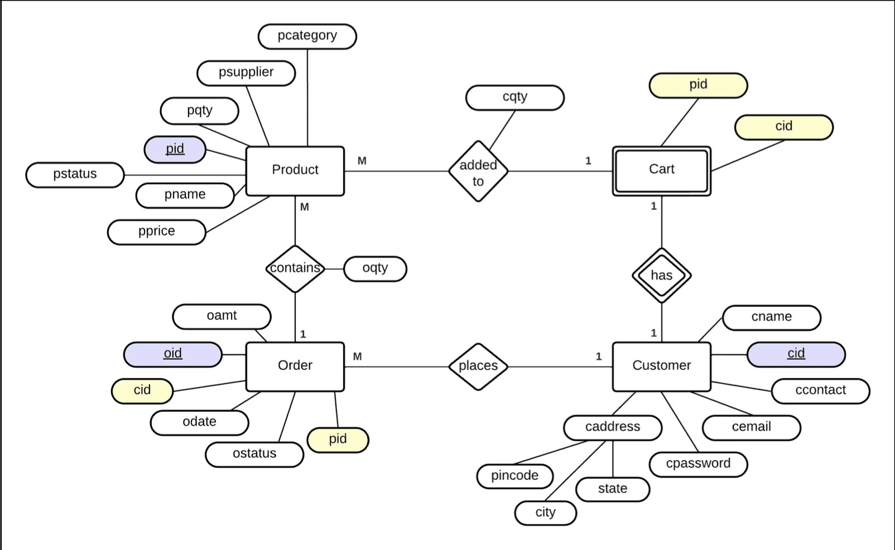

# 🛒 ShopEase - E-commerce Website  

A full-stack e-commerce web application where users can explore, search, and purchase items across multiple categories such as electronics, fashion, and more. The platform provides a seamless shopping experience with features like authentication, persistent shopping carts, order management, and dynamic product images.  

🚀 **Live Demo:** [YouTube Demo](https://youtu.be/kmni1OqkFVg)  
💻 **GitHub Repo:** [ShopEase](https://github.com/dhruvbhardwaj14/shopEase.git)  

---

## 📌 Features  

- 🔐 **User Authentication** (Signup/Login with password hashing)  
- 🛍 **Browse Products by Category**  
- 🛒 **Persistent Shopping Cart** (Add, update, delete items)  
- 📦 **Order Management** (Place, view, cancel orders)  
- 🖼 **Dynamic Product Images** (via Unsplash API integration)  
- ⚡ **Responsive Frontend** using ReactJS + TailwindCSS  

---

## 🏗 Tech Stack  

### **Frontend**  
- ReactJS (18.3.1)  
- TailwindCSS (3.4.15)  
- Axios (1.7.7)  

### **Backend**  
- Node.js (Runtime)  
- Express.js (4.21.1)  
- MySQL (via phpMyAdmin v4.7.1)  
- bcryptjs (2.4.3) for password hashing  
- CORS (2.8.5)  
- Nodemon (3.1.7)  

### **Database**  
- MySQL (phpMyAdmin)  
- Hosted on `sql12.freesqldatabase.com`  

### **APIs**  
- Unsplash API (Dynamic product images)  

---

## 🗄 Database Design  

### **Schema**  

**Customer Table**  
| Column         | Type        | Constraint        |  
|----------------|------------|------------------|  
| cid            | char(36)   | Primary Key       |  
| cname          | varchar(40)|                  |  
| ccontact       | varchar(15)|                  |  
| cemail         | varchar(40)| Unique            |  
| cpwd           | varchar(60)|                  |  
| caddr_city     | varchar(20)|                  |  
| caddr_state    | varchar(30)|                  |  
| caddr_pincode  | char(6)    |                  |  

**Product Table**  
| Column    | Type         | Constraint            |  
|-----------|-------------|-----------------------|  
| pid       | int(11)     | Primary Key           |  
| pname     | varchar(40) |                       |  
| pprice    | decimal(8,2)|                       |  
| pcategory | varchar(20) |                       |  
| pqty      | int(11)     |                       |  
| pstatus   | enum('available','out of stock','removed') |  
| psupplier | varchar(40) |                       |  

**Cart Table**  
| Column | Type     | Constraint                       |  
|--------|---------|----------------------------------|  
| cid    | char(36)| Foreign Key (Customer), Primary Key |  
| pid    | int(11) | Foreign Key (Product)             |  
| cqty   | int(11) |                                   |  

**Order Table**  
| Column  | Type     | Constraint                                       |  
|---------|---------|--------------------------------------------------|  
| oid     | int(11) | Primary Key, Auto Increment                      |  
| cid     | char(36)| Foreign Key (Customer)                           |  
| pid     | int(11) | Foreign Key (Product)                            |  
| oamt    | int(11) |                                                  |  
| odate   | date    |                                                  |  
| ostatus | enum('placed','out for delivery','shipped','cancelled') |  
| oqty    | int(11) |                                                  |  

### **Entity Relationship Diagram**  
  

---

## ⚙️ Backend Endpoints  

### **Products**  
- Get all products / by category  
- Get product details by `pid`  

### **Cart**  
- Add product to cart (with quantity updates)  
- Fetch all items in cart for a user  
- Update product quantity in cart  
- Remove specific item from cart  
- Clear entire cart  

### **Orders**  
- Place an order (direct / from cart)  
- Reduce stock on successful order  
- Fetch all orders for a user  
- Cancel an order  

### **Users**  
- Signup (with UUID + hashed password)  
- Login (email + password check)  

---

## 🌐 API Integration (Unsplash)  

Products are displayed with real-time images fetched dynamically from **Unsplash API**:  

```js
const response = await fetch(
  `https://api.unsplash.com/search/photos?query=${product.pname}&per_page=1`,
  { headers: { Authorization: `Client-ID ${ACCESS_KEY}` } }
);
```
Fallback to a placeholder image if no result is found.  

---

## 🚀 Installation & Setup  

### **1. Clone the Repository**  
```bash
git clone https://github.com/dhruvbhardwaj14/shopEase.git
cd shopEase
```

### **2. Install Dependencies**  
```bash
npm install
```

### **3. Setup Database**  
- Import the MySQL schema provided in the documentation.  
- Update your **db config** in `db.js`:  
```js
const db = mysql.createConnection({
  host: "sql12.freesqldatabase.com",
  user: "your_user",
  password: "your_password",
  database: "your_database",
});
```

### **4. Run Backend**  
```bash
npm run dev
```

### **5. Run Frontend**  
```bash
npm start
```

---

## 📽 Project Demo  

- 🎥 [YouTube Demo](https://youtu.be/kmni1OqkFVg)  
- 💻 [GitHub Repository](https://github.com/dhruvbhardwaj14/shopEase.git)  

---

## 📚 References  

- [FreeCodeCamp](https://www.freecodecamp.org)  
- [W3Schools](https://www.w3schools.com)  
- [Stack Overflow](https://stackoverflow.com)  
- [DigitalOcean](https://www.digitalocean.com)  
- [Unsplash](https://unsplash.com)  
- [phpMyAdmin](https://www.phpmyadmin.net)  

---

✨ Developed by **Dhruv Bhardwaj**  
